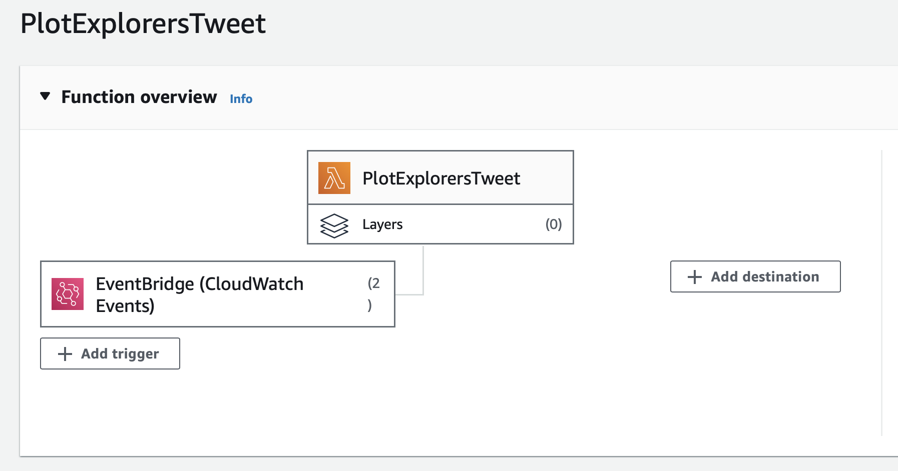

# Book Insight Generator 📚🚀

[](https://github.com/Lutir/book-tweety/stargazers)
[](https://github.com/Lutir/book-tweety/issues)

Welcome to the Book Insight Generator! This fun and educational project utilizes the power of GPT to generate fascinating insights about books and authors, all condensed into tweet-sized nuggets of wisdom. And the best part? It automatically tweets these insights to your Twitter account daily!

## How It Works

1. **Input**: Provide the name of a book and its author.
2. **GPT Magic**: Our GPT-powered AI gets to work, analyzing the book and author's information.
3. **Tweet Creation**: It crafts a concise and captivating tweet based on the generated insights.
4. **Tweet to Twitter**: Your Lambda function tweets the insight to your Twitter account, delighting your followers with literary gems every day.

### Architecture

<!-- Replace with your project's logo or banner -->
<p align="center">
  
</p>

## Installation

### Prerequisites

- An AWS account with AWS Lambda set up.
- Twitter Developer API keys.
- Python and required dependencies installed.

### Setup

1. Clone the repository:

   ```bash
   git clone https://github.com/your-username/your-project.git
2. Configure your AWS Lambda function and set up EventBridge rules to trigger it at your desired intervals (e.g., daily).

3. Configure your Twitter API keys.
4. Deploy the Lambda function.

### Usage

1. Invoke the Lambda function with the book and author details as input.
2. Sit back and watch as your Twitter account comes alive with daily book insights!

### Features

- 📚 Discover new books and authors.
- 🤖 Leverage GPT's AI capabilities for insightful tweets.
- 📅 Schedule daily tweets with EventBridge rules.
- 🚀 Share your love for reading with your Twitter followers.
  
### Contributing

If you'd like to improve this project or add new features, feel free to submit pull requests!


